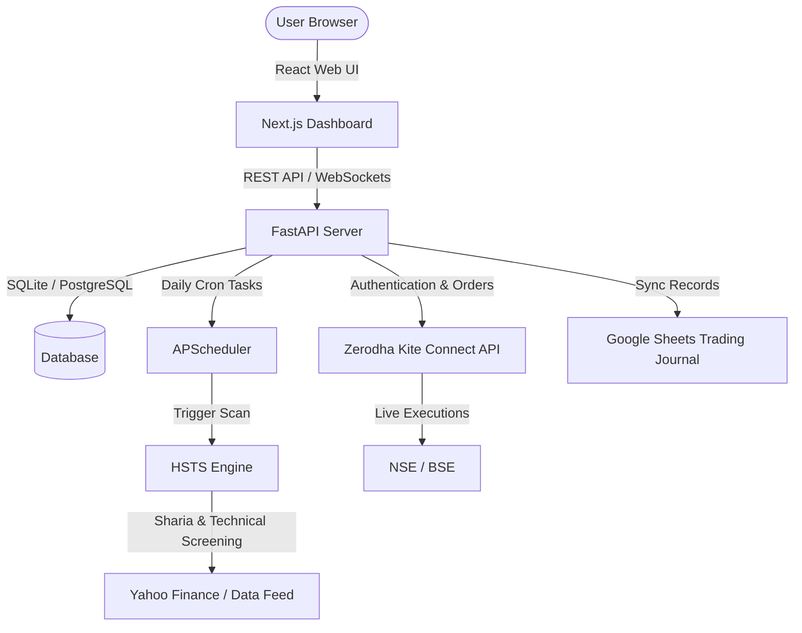

# HSTS Automated Web Application: Tech Stack & Architecture

This document outlines the proposed production tech stack, database schema, and deployment architecture to transform the HSTS CLI engine into a web-hosted, fully automated trading application integrated with your Zerodha account.

---

## 1. System Architecture

---

## 2. Core Tech Stack

### A. Backend Application
* **Programming Language:** Python 3.11+
* **Web Framework:** **FastAPI** (asynchronous, high performance, auto-generated Swagger API documentation).
* **Broker Integration SDK:** **`kiteconnect`** (official Zerodha Kite Connect SDK for authentication, order placement, and live status streaming).
* **Task Scheduler:** **`APScheduler`** (manages cron schedules for Nifty regime check at 9:00 AM, market scanner at 9:30 AM, and trailing stop checks).
* **Real-time Engine:** **WebSockets** (to push live order fills and scanning scores directly from backend to frontend dashboard).

### B. Frontend Dashboard
* **Framework:** **Next.js 14 / React.js** (for a premium, highly responsive user interface).
* **Styling:** **TailwindCSS** with dark-mode glassmorphism aesthetics.
* **State Management:** **Zustand** or **Redux Toolkit** (lightweight state synchronization with FastAPI WebSockets).
* **Charting:** **ApexCharts / Recharts** (for visualizing account balance growth, win-rates, and live trade entries).

### C. Database & Caching
* **Primary Database:** **SQLite** (for simple local database deployments) or **PostgreSQL** (production standard).
* **Data Storage Includes:** 
  * App Configurations (e.g. Current Bot state: ON/OFF, Risk per trade %).
  * Active Orders & Trades (Tracking current stop-loss, target, and position quantities).
  * System execution logs.

### D. Hosting & DevOps
* **Containerization:** **Docker & Docker Compose** (ensures environment parity between local development and cloud hosting).
* **Cloud Hosting:** **DigitalOcean Droplet** or **AWS EC2 instance** located in the **Mumbai (ap-south-1)** region to minimize API latency to Zerodha's servers.
* **Process Manager:** **Gunicorn** with **Uvicorn** workers.
* **Reverse Proxy:** **Nginx** with **Let's Encrypt** SSL encryption.

---

## 3. Zerodha Kite Connect Integration Steps

To activate the automated engine later:

1. **Register Developer Account:** Go to [kite.trade](https://kite.trade/) and create an account.
2. **Create a Developer App:** Set up a redirect URL (e.g., `https://your-dashboard.com/api/auth/callback`).
3. **API Subscription:** Subscribe to the Kite Connect API:
   * **Base API Access:** ₹2,000 / month (Required for orders, margins, holdings).
   * *Optional:* Historical API (₹4,000 / month) — *Note: We bypass this cost by using `yfinance` or a free equivalent.*
4. **App Credentials:** Copy your `API Key` and `API Secret` to the HSTS backend `.env` variables.
